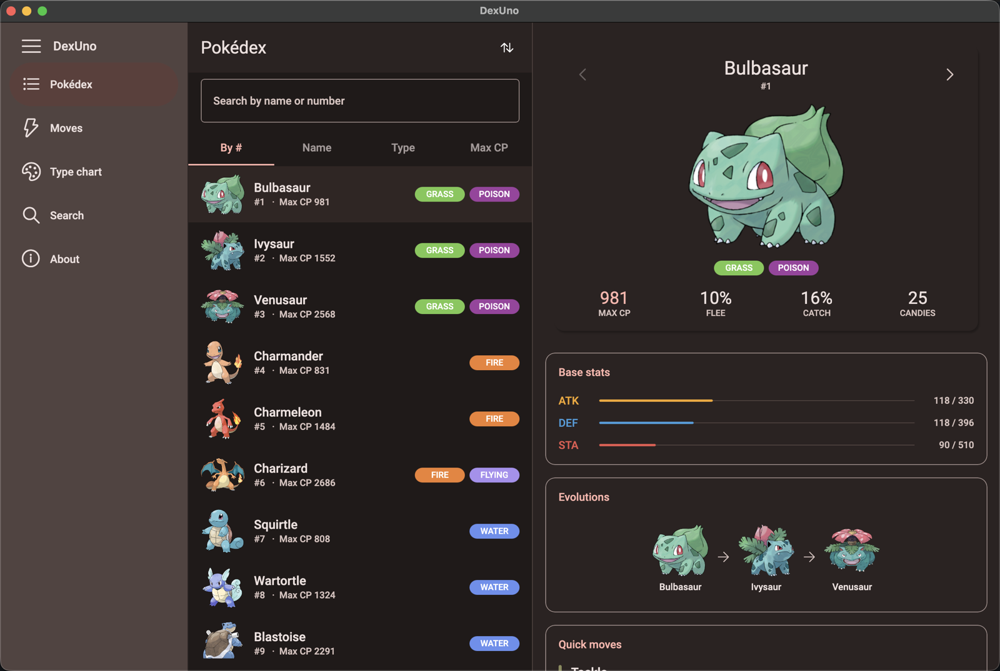
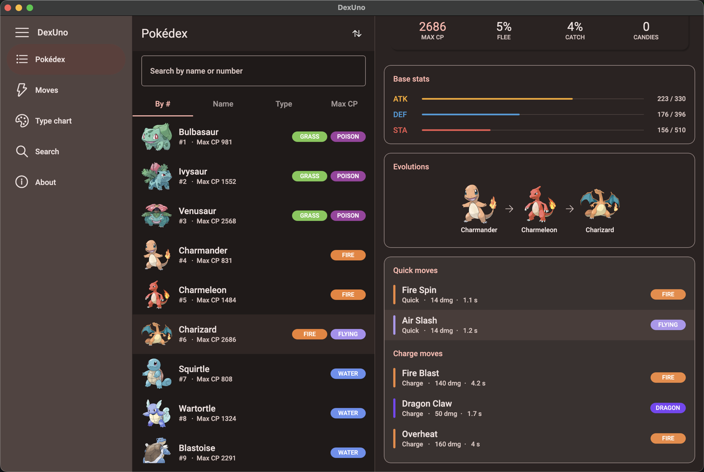
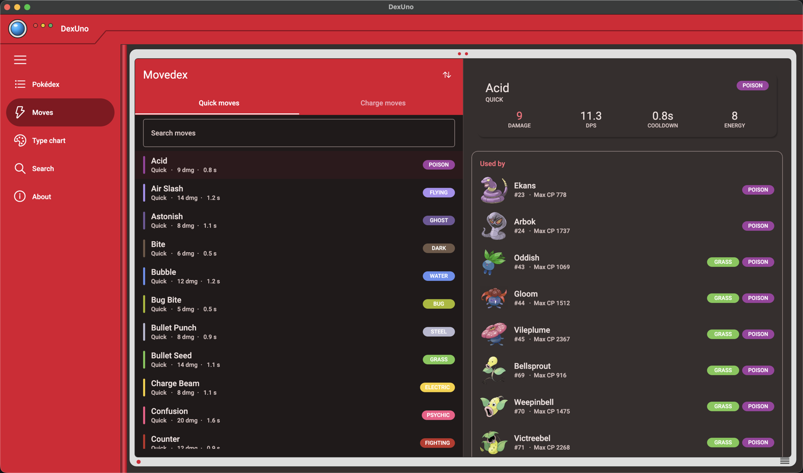
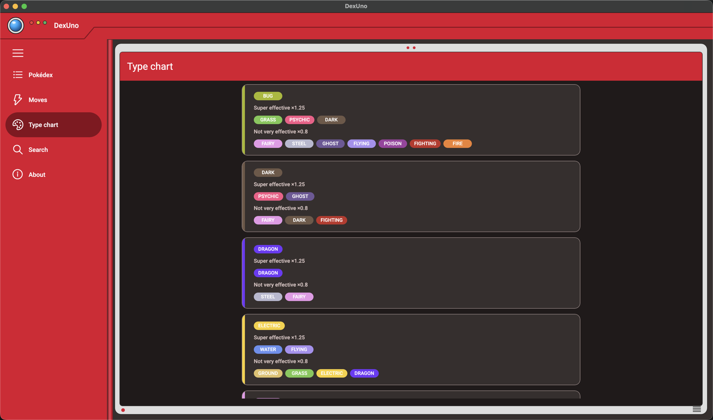
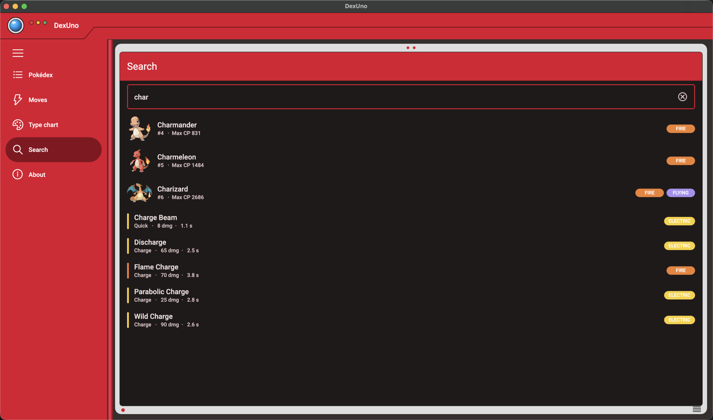
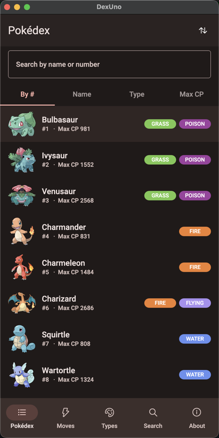
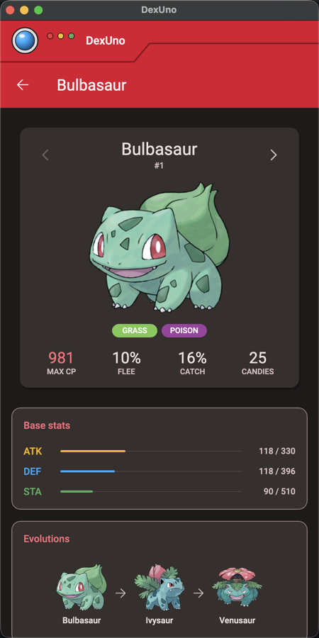

# DexUno

[](https://github.com/kazo0/DexUno/actions/workflows/ci.yml)
[](https://github.com/kazo0/DexUno/actions/workflows/release.yml)

A Pokémon GO pokédex — browse every Pokémon, compare moves, and check type match-ups, entirely offline.

DexUno is a modernization of **[Dexr](https://github.com/disklosr/Dexr)** by [disklosr](https://github.com/disklosr), a UWP
Pokédex for Pokémon GO that shipped on the Microsoft Store for Windows 10. The original's data set, domain model and
overall information architecture are carried forward here; the app around them has been rebuilt on
[Uno Platform](https://platform.uno) and .NET 10 so the same code base runs on Windows, macOS, Linux, iOS, Android
and the web.

All credit for the original app and its curated game data goes to disklosr — see [Credits](#credits).

## Screenshots

Skia desktop head on macOS, dark theme. The shell is styled after the classic Kanto Pokédex.

**Pokédex — master / detail**



**Pokémon detail — base stats, evolution line, move set**



**Movedex — moves and the Pokémon that learn them**



| Type chart | Global search |
| :-- | :-- |
|  |  |

**Phone width — bottom tab bar, list pushes a full detail page**

| | |
| :-- | :-- |
|  |  |

## Features

### Pokédex

- All **251 Pokémon** in the bundled data set, listed with dex number, max CP and type badges. Artwork ships for
  #1–151; later entries fall back to a placeholder.
- **Sort** by dex number, name, type or max CP, each reversible from the toolbar.
- **Search** by name or dex number, filtering as you type.
- **Incremental loading** — the list pages in as you scroll rather than materializing hundreds of rows up front.
- **Master / detail** through a `TwoPaneView`: on wide windows selecting a Pokémon fills a side pane, on narrow
  ones the same selection pushes a full detail page, and on a dual-screen device the list and detail sit one per
  screen with the hinge between them.

### Pokémon detail

- Max CP, flee rate, catch rate and candy-to-evolve.
- **Base stats** (attack, defence, stamina) drawn as gauges scaled against the highest value in the dex.
- **Evolution line** rendered as a chain, with the current stage highlighted; tap any stage to jump to it.
- **Quick and charge move sets**, each tappable through to the move's own detail.
- Previous / next arrows to walk the dex without going back to the list.

### Movedex

- **58 quick moves** and **118 charge moves**, split across two tabs.
- Damage, DPS, cooldown and energy for each move, colour-coded by type.
- Search and reversible sort, with the same incremental loading as the Pokédex.
- **"Used by"** — every Pokémon that can learn the move. Common moves have well over a hundred users, so this list
  pages in as the detail view is scrolled.

### Type chart

- All **18 types**, each as a card listing what it is super effective (×1.25) and not very effective (×0.8) against.

### Search

- One query across **both Pokémon and moves**, results interleaved and each routed to the right detail page.

### Shell

- **Responsive navigation** — one shell with three breakpoints: an expanded `NavigationView` pane at ≥1200px, an
  icons-only rail from 700px, and a bottom `TabBar` below that. All three drive the same navigation regions.
- **Foldable and dual-screen aware** — `Uno.WinUI.Foldable` feeds the fold or hinge bounds to the master/detail
  `TwoPaneView`, so a foldable — flat or half-opened — or a spanned Surface Duo puts the list and the detail one per
  screen with the seam on the crease, and re-lays out live as the posture changes; everything else uses size-based
  breakpoints. The Android head carries a small shim around the package (see `AGENTS.md`).
- **Styled as a Pokédex** — the Material 3 palette is generated by Uno Themes' seed-colour engine from three
  colours sampled from the classic Kanto Pokédex (the red body, the blue lens, the green button), and the shell
  wears the hardware: the notched top plate with the lens and three indicator lights, a red navigation pane and
  tab bar, the hinge, and on tablet/desktop widths a grey display bezel with its two dots and speaker grille
  around the dark screen. Stat gauges use the indicator-light colours. Light and dark variants follow the
  system theme.
- **Fully offline** — all data is embedded in the app; there is no network call anywhere.
- Custom animated **Pokéball loading indicator**, used for the extended splash screen and every async load.

## What the modernization changed

| | Dexr / legacy DexUno | DexUno.Modern |
| :-- | :-- | :-- |
| Platforms | Windows 10 only (UWP) | Windows, macOS, Linux, iOS, Android, WebAssembly |
| Framework | UWP, later Uno 3.x | Uno Platform 7 (`Uno.Sdk`), single project |
| Runtime | .NET Native / netstandard2.0 | .NET 10 |
| Project shape | Shared project (`.shproj`) + 8 platform heads | One csproj, multiplatform `TargetFrameworks` |
| Presentation | MVVM, `ViewModelBase`, `INotifyPropertyChanged` | MVUX — immutable records, `IFeed`/`IState`, generated view models |
| Async UI | Manual `IsLoading` flags per view model | `FeedView` renders loading / error / empty / data states declaratively |
| Navigation | `NavigationService` singleton + hard-coded page map + naming-convention VM lookup | Uno.Extensions route- and region-based navigation, DI-resolved models |
| Composition root | Static `Startup.ServiceProvider` service locator | `IHost` with constructor injection throughout |
| Lists | `ListView` loading whole collections | `ItemsRepeater` with paginated feeds and incremental loading |
| JSON | Newtonsoft.Json, read from `StorageFile` at runtime | `System.Text.Json` source generation over embedded resources |
| Theming | Hand-rolled brushes and styles, user-picked accent colour | Material 3 theme generated from three Pokédex seed colours |
| Dual screen | `TwoPaneView` + `Uno.UI.DualScreen` spike on the Android head only | `TwoPaneView` + `Uno.WinUI.Foldable` in the single project: hinge-aware on dual-screen Android, size-driven on every other platform |

Deliberately not carried over: the accent-colour and picture-source settings page (the app now follows the system
theme), and the Windows-only composition animations. The original's separate global search page became a first-class
section of the shell.

## Repository layout

| Path | |
| :-- | :-- |
| `DexUno.Modern/` | **The current app.** Uno Platform single project, .NET 10, MVUX. |
| `DexUno.Modern/DexUno.Modern.Core/` | Domain library — entities, repositories, CP calculator, type service. No UI dependencies. |
| `DexUno.Modern/DexUno.Modern/` | The Uno app — pages, models, converters, styles, embedded data and artwork. |
| `DexUno.sln`, `DexUno/`, `DexUno.Core/` | The legacy 2020-era Uno 3.x port, kept for reference. Does not build on current tooling. |
| `AGENTS.md` | Architecture and conventions, the source of truth for contributors and coding agents. |

## Building and running

Requires the .NET 10 SDK. The `Uno.Sdk` version is pinned in `DexUno.Modern/global.json`.

From `DexUno.Modern/DexUno.Modern/`:

```bash
dotnet build -f net10.0-desktop          # Skia desktop (macOS/Linux/Windows) — the fast inner loop
dotnet run   -f net10.0-desktop          # launch it
dotnet build -f net10.0-browserwasm      # WebAssembly
dotnet build -f net10.0-ios              # needs the iOS workload
dotnet build -f net10.0-android          # needs the Android workload
```

Windows is served by the same Skia desktop head as macOS and Linux; there is no WinAppSDK target. The first restore
of a `-dev` `Uno.Sdk` version can take several minutes.

Use `-p:TargetFrameworkOverride=<android|ios|wasm|desktop>` (or a local `crosstargeting_override.props`,
see the `.sample` next to the solution) to keep restore off the platforms you are not building.

See [AGENTS.md](AGENTS.md) for the architecture in detail.

## Releases

- **Web**: the WebAssembly build is deployed to GitHub Pages at <https://kazo0.github.io/DexUno/> with every release.
- **Android / iOS**: published to Google Play and the App Store from the release pipeline; every merge to `master`
  also ships to the Play internal track and TestFlight.
- **Desktop**: self-contained zips for Windows (x64), Linux (x64) and macOS (Apple silicon) are attached to each
  [GitHub release](https://github.com/kazo0/DexUno/releases). They are unsigned, so Gatekeeper / SmartScreen will warn.

Versions come from [Nerdbank.GitVersioning](https://github.com/dotnet/Nerdbank.GitVersioning) (`version.json`);
release branches are cut with `nbgv prepare-release`. The pipeline and its one-time setup are described in
[docs/RELEASE-SETUP.md](docs/RELEASE-SETUP.md). The app collects no data — see the
[privacy policy](docs/privacy-policy.md).

## Credits

- **[Dexr](https://github.com/disklosr/Dexr)** by **[disklosr](https://github.com/disklosr)** — the original UWP app
  this project modernizes, and the source of the bundled game data. MIT licensed.
- Pokémon artwork by [The Artificial](http://theartificial.nl/pokemonicons/), licensed
  [CC-BY-3.0](https://creativecommons.org/licenses/by/3.0/).
- Application icon by Maicol Torti, licensed [CC-BY-2.5](http://creativecommons.org/licenses/by/2.5/).
- Built with [Uno Platform](https://platform.uno).

This app is not associated with Nintendo or Niantic in any way. Pokémon and Pokémon character names are trademarks of
Nintendo.
